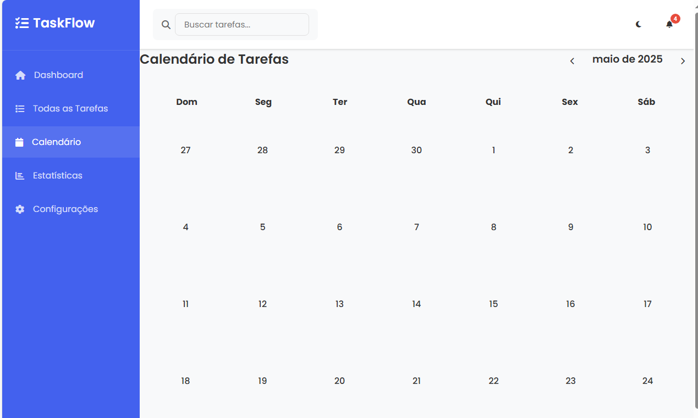
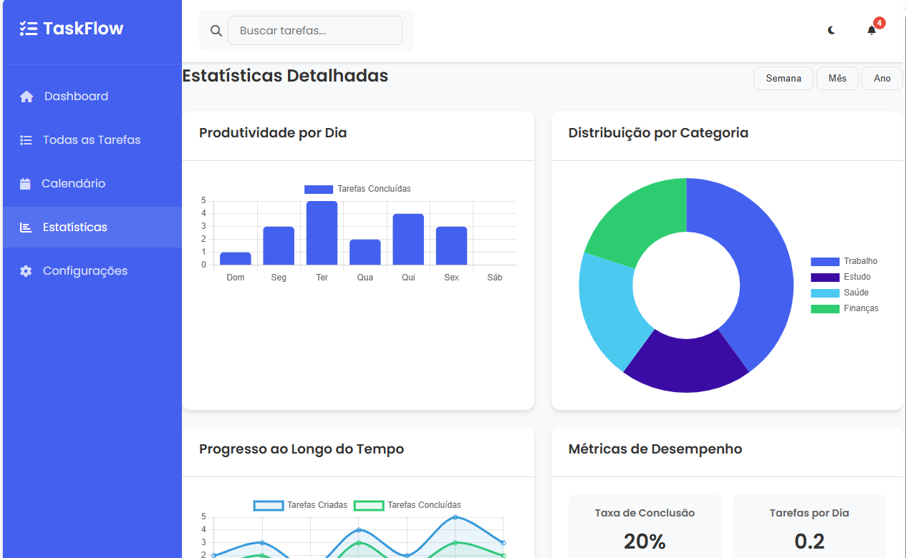
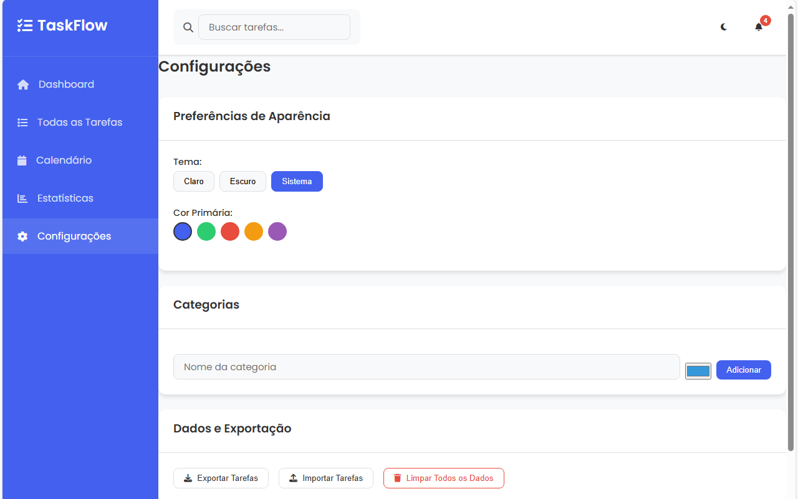

# TaskFlow - Gerenciador de Tarefas Interativo

<p align="center">
  
</p>

## 📋 Sobre o Projeto

TaskFlow é um aplicativo web completo para gerenciamento de tarefas desenvolvido com JavaScript puro, HTML5 e CSS3. Ele oferece uma interface intuitiva, estatísticas visuais e diversas funcionalidades para organizar seu dia a dia sem depender de frameworks ou bibliotecas externas (exceto Chart.js para visualização de dados).

## 📸 Demonstração

<div align="center">
  <div style="display: flex; justify-content: space-between; margin-bottom: 20px;">
    
    
  </div>
  <div style="display: flex; justify-content: space-between;">
    
    
  </div>
</div>

## 🚀 Funcionalidades

- ✅ **Gerenciamento Completo**: Criação, edição e exclusão de tarefas
- 📊 **Dashboard Interativo**: Estatísticas e gráficos para acompanhar sua produtividade
- 🔍 **Busca Avançada**: Filtragem por categoria, status, data e prioridade
- 🔔 **Notificações**: Sistema integrado para acompanhar mudanças
- 📅 **Calendário Interativo**: Visualização com painel de tarefas por dia
- 🎨 **Personalização Visual**: Temas claro e escuro para melhor experiência
- 📱 **Responsivo**: Design adaptado para todos os dispositivos
- 💾 **Persistência**: Armazenamento local das tarefas (localStorage)
- 📂️ **Organização**: Categorização de tarefas com sistema visual de cores
- 🚩 **Prioridades**: Sistema visual de níveis de importância
- 📅 **Prazos**: Gerenciamento de datas limite com alertas
- 💾 **Backup**: Exportação e importação de dados

## 💻 Tecnologias Utilizadas

- **HTML5** - Estruturação semântica da página
- **CSS3** - Estilização moderna com Flexbox, Grid e variáveis CSS
- **JavaScript** - Funcionalidades dinâmicas e interativas
- **Chart.js** - Visualização de dados com gráficos interativos
- **LocalStorage API** - Persistência de dados no navegador
- **Font Awesome** - Ícones vetoriais
- **Google Fonts** - Tipografia responsiva

## 🛠️ Arquitetura do Projeto

O projeto segue uma estrutura modular para facilitar a manutenção e extensão:

```
taskflow/
├── index.html              # Estrutura principal da página
├── css/
│   ├── style.css           # Estilos base e layout
│   ├── components.css      # Componentes reutilizáveis
│   ├── calendar.css        # Estilos específicos para o calendário
│   └── responsive.css      # Media queries para responsividade
├── js/
│   ├── app.js              # Inicialização e configurações gerais
│   ├── tasks.js            # Gerenciamento de tarefas (CRUD)
│   ├── storage.js          # Persistência de dados com localStorage
│   ├── charts.js           # Gráficos e visualizações
│   └── notifications.js    # Sistema de notificações
└── assets/                 # Recursos adicionais
```

## 🔍 Destaques Técnicos

- **Arquitetura Modular**: Código organizado em módulos de responsabilidade única
- **Padrão de Projeto Observer**: Atualização automática da UI quando os dados mudam
- **Persistência de Dados**: Armazenamento local para funcionamento offline
- **Design System**: Sistema de cores, espaçamentos e componentes consistentes
- **Acessibilidade**: Implementação de práticas de acessibilidade básicas
- **Performance**: Otimizações para carregamento rápido e interação fluida

## 🚦 Como Executar

1. Clone este repositório
2. Abra o arquivo `index.html` em um navegador moderno
3. Ou acesse a [versão online](https://seu-username.github.io/taskflow) (atualizar este link após publicação)

## 📝 Próximos Passos

- [ ] Adicionar autenticação de usuários
- [ ] Sincronizar dados com backend
- [ ] Criar sistema de subtarefas
- [ ] Adicionar funcionalidade de etiquetas personalizadas
- [ ] Implementar integração com outros calendários (Google Calendar, Outlook)
- [ ] Adicionar recursos de colaboração em equipe

## 👤 Autor

**WELLINGTON MEDEIROS**
- GitHub: [@wellington-mc](https://github.com/seu-username) <!-- Atualize com seu nome de usuário do GitHub -->
- LinkedIn: [wellington-medeiros](https://www.linkedin.com/in/wellington-medeiros-8891942b0/) <!-- Atualize com seu perfil do LinkedIn -->

## 📄 Licença

Este projeto está licenciado sob a Licença MIT - veja o arquivo LICENSE para detalhes.
